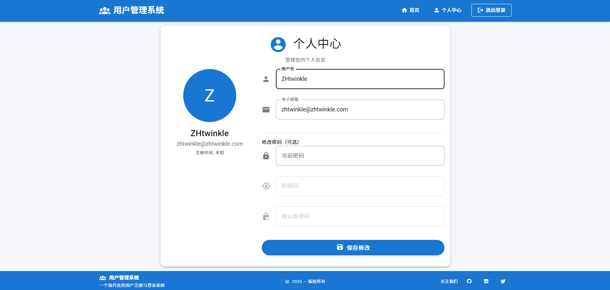

# 用户注册与登录系统

一个美观现代的用户注册与登录系统，基于以下技术构建：
- 后端：NestJS
- 前端：Vue.js
- 数据库：SQLite

## 项目结构
- `/backend` - NestJS 后端应用
- `/frontend` - Vue.js 前端应用

## 功能特点
- 用户注册
- 用户登录
- 用户认证
- 个人资料管理
- 响应式界面设计

## 快速开始

### 后端设置
```bash
cd backend
npm install
npm run start:dev
```

### 前端设置
```bash
cd frontend
npm install
npm run serve
```

## 使用的技术
- NestJS - 一个用于构建高效、可扩展的服务器端应用程序的渐进式 Node.js 框架
- Vue.js - 一个用于构建用户界面的渐进式 JavaScript 框架
- SQLite - 一个轻量级的基于磁盘的数据库
- TypeORM - 用于 TypeScript 和 JavaScript 的 ORM
- Vue Router - Vue.js 的官方路由
- Vuetify - 用于 Vue.js 的 Material Design 组件框架

## 系统截图




## 安全特性
- 密码哈希加密存储
- JWT 令牌认证
- 防止跨站请求伪造 (CSRF)
- 输入验证与清洗

## 贡献指南
欢迎提交 Pull Request 或提出 Issue 来改进这个项目。

## 许可证
MIT
